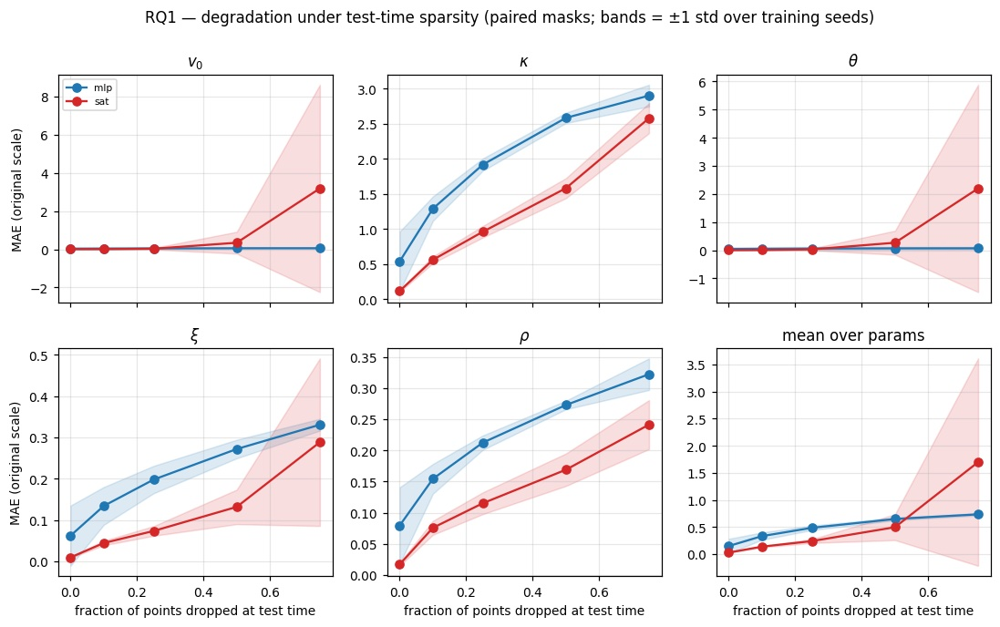
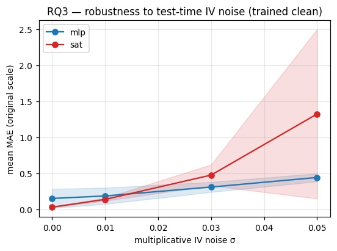
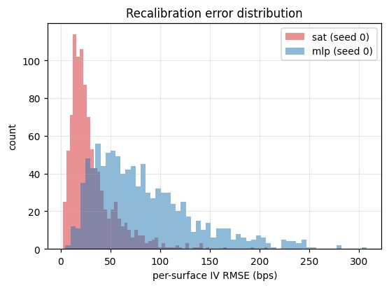

# Archietcture and Experiment Analysis

## Introduction and Motivation

The problem this project aims to solve is an optimal method the calibration of the Heston model. When we calibrate the Heston model we are trying to find the five values for these parameters that match the market dynamics as close as possible. Intuitively one would define a loss function between model prices and market prices and try to minimise it, the problem with this is that mapping from these parameters to option prices is extremely non-linear. This means that the loss function has an extremely complicated shape with many local minima, thus two very different parameterisation can produce almost identical prices. Classic optimisers work iteritevaly, first guess some parameters, then compute the loss, then adjust the parameters and repeat until it converges, which requires significant computation. The Machine Learning approach sidesteps this problem entirely. We do all the expensive computation once at training time and then at inference we can just do a single forward pass of the model, which is just a fixed sequence of matrix operations.

Mathematically, a volatility surface is simply a set of $(K, T, \sigma)$ triples, there is no canonical ordering. Thus, the function that our machine learning model will attempt to approximate will be a permutation invariant function acting on sets. We define these terms as following:

A function acting on sets is a map

$$
f : 2^X \to Y,
$$

where $2^X$ denotes the power set of $X$.

A function $f : 2^X \to Y$ acting on sets is permutation invariant if, for any permutation $\pi$,

$$
f(\{x_1,\ldots,x_M\}) = f(\{x_{\pi(1)},\ldots,x_{\pi(M)}\}).
$$

It can be further demonstrated that a function $f : 2^X \to Y$ acting on sets is permutation invariant if and only if it can be decomposed as

$$
f(X) = \rho\left(\sum_{x \in X} \phi(x)\right),
$$

for suitable transformations $\phi$ and $\rho$, which in the machine learning context will usually be an encoder ($\phi$), and a decoder ($\rho$) which are composed of several layers.

For these reasons we propose a variant of the Set Transformer for this problem, where the encoder and decoder functions are:

$$\phi(X) = SAB(SAB(X))$$

$$\rho(Z) = rFF(PMA_{4}(Z))$$

Where SAB is a self attention block layer, $PMA_{4}$ is a pooling by multi-head attention layer with 4 seed vectors, rFF is a feedforward network. We will now explicate the function of these layers.

## The Set Transformer

### Self Attention Block architecture

  

Self-attention is a mechanism is a mechanism that relates different elements of a set or sequence, with a goal of computing a represntation of this set/sequence. This mechanism has the advantage that the are no recurrence relations between elements, so all elements are related in a single operation ($O(1)$ path length). Given 3 vectors Q (the query), K (the key), and V (the value), we compute:

$$Attention(Q,K,V) = Softmax(\frac{QK^{T}}{\sqrt{d_{k}}})V$$

where $d_{k}$ is the dimension of the vector K. Multi-head attention linearly projects the queries, keys and values h times with different, learned linear projections to $d_{k}$ , $d_{k}$ and $d_{v}$ dimensions, and is computed by:

$$MultiHead(Q,K,V) = Concat(head_{1}, ... , head_{h})W^{O}$$

$$head_{i} = Attention(QW_{i}^{Q}, KW_{i}^{K}, VW_{i}^{V})$$

Where $W_{i}^{Q}$, $W_{i}^{K}$, $W_{i}^{V}$, and $W^{O}$ are learned weight matrices.

A Multi-head attention block is a function on to sets X and Y defined by:

$$MAB(X,Y) = LayerNorm(H + rFF(H)) \qquad H = LayerNorm(X + MultiHead(X,Y,Y))$$

Where LayerNorm is the layer normalisation operation (see Training and Evaluation section). Finally we define the set attention block as a function on a set X, given by:

$$SAB(X) = MAB(X,X)$$

### Pooling by Multi-head Attention Architecture

  

Pooling by Multi-head Attention uses a set (S) of k seed vectors with learnable paramteres to aggregate the features, we define the function as:

$$PMA_{k}(Z) = MAB(S, rFF(Z))$$

### Set Transformer Architecture We Use For the Model Calibration Problem

  

Given a set X of $(K, T, \sigma)$ triples we compute the Heston paramters with the encoder-decoder transformation:

$$Encoder(X) = SAB(SAB(X))$$

$$Decoder(Z) rFF(PMA_{4}(Z)$$

Matching the functions $\phi$, and $\rho$ defined in the previous section.

## Baselines and Ablations

1. MLP baseline. We use an MLP with hidden dimensions 512–256–128, GELU activations, batch normalisation, and dropout to map the flattened $120\times3$ surface to the five parameters. This serves as baseline and the control for the entire set-based approach since it doesn't impose any relational structure and is not permutation invariant, treating each (log-moneyness, maturity, IV) slot as a fixed coordinat. It has ~351k parameters it is approximately two and half times the size of the Set Transformer, a deliberately capacity-generous control.

2. PMA vs SAB ablations. These two ablations remove one attention component from the set transformer whilst keeping everything else the same, decomposing it into its encoder and its pooling. These ablations aim to identify what the more important components of the set transformer are.

3. Transformer-PE is architecturally close to the set transformer, it is a self-attention encoder with a mean-pooled decoder but adds sinusoidal positional encodings to the token embeddings (~150k params). The PE injects the grid index as a feature and breaks permutation invariance; each token already carries its $(log m, \sqrt{\tau})$coordinates as input channels, so the positional signal is largely redundant. This architecture is mainly measures the cost of discarding permutation invariance, not a benefit from added position.

4. 2D CNN. This model reshapes the surface into a $15\times8$ image over $(log-moneyness \times maturity)$ with three channels and applies a stack of $3 \times 3$ convolutions (~226k params). The convolution imposes a spatial-locality inductive bias, adjacent grid cells are related, and local filters can identify features such as smile curvature. This comparison looks at whether that locality bias, which seems intuitive for a smooth surface, gives any advantage over the set transformer's global, order-free attention. Like the MLP, it requires the full fixed grid and is not permutation-invariant.

## Training and Evaluation

Label Space: We apply the following transformations to the label space prior to training: log on the four strictly-positive params ($v_{0}, \kappa, \theta, \xi$), and arctanh on $\rho$. This is because log maps positives onto ℝ and equalizes the scale of the parameters (raw $\kappa$ can reach 8 while $v_{0}/\theta$ only reach 0.25, so untransformed MSE would be dominated by $\kappa$); arctanh respects the open interval $\rho \in (−1,1)$.

Objective and Metrics: The loss function we aim to minimise in training is MSE on the transformed targets. Mean Absolute Error and $R^{2}$ are then computed after inverse-transforming both prediction and target back to natural units, as performance metrics

Layer Normalisation: Our set transformer architecture uses layer normalisation to both reduce training time, and regularise the model. At each layer l the mean and variance of the inputs are computed by:

$$\mu_t = \frac{1}{H}\sum_{i=1}^{H} a_i^t \qquad \sigma_t = \sqrt{\frac{1}{H}\sum_{i=1}^{H}\left(a_i^t - \mu_t\right)^2}$$

The inputs are then normalised, with the normalised inputs being given by:

$$\hat{a}_i^{\ell} = \frac{a_i^{\ell} - \mu_i^{\ell}}{\sigma_i^{\ell}}$$

Adaptive Gradient with Decoupled Weight Decay Regularisation (AdamW): We update weights using the AdamW algorithm

$$
t \leftarrow t+1
$$

$$
\nabla_{\theta_t} L(\theta_{t-1}) \leftarrow \text{batch}(\theta_{t-1})
$$

$$
g_t \leftarrow \nabla_{\theta_t} L(\theta_{t-1})
$$

$$
m_t \leftarrow \beta_1 m_{t-1} + (1-\beta_1)g_t
$$

$$
v_t \leftarrow \beta_2 v_{t-1} + (1-\beta_2)(g_t)^2
$$

$$
\hat{m}_t \leftarrow \frac{m_t}{1-\beta_1^t}
$$

$$
\hat{v}_t \leftarrow \frac{v_t}{1-\beta_2^t}
$$

$$
\eta_t \leftarrow \text{schedule}(t)
$$

$$
\theta_t \leftarrow \theta_{t-1} - \eta_t \left(\alpha \frac{\hat{m}_t}{\sqrt{\hat{v}_t}+\epsilon} + \lambda \theta_{t-1}\right)
$$

## Experiment Results

### Table 1 - Headline accuracy: Set Transformer vs Multi-Layer Perceptron

| Model | Params | Seed | MAE | R² |
|---|---:|---:|---:|---:|
| SAT (PMA, 2 SAB) | 142,405 | 0 | 0.0289 | 0.9941 |
| SAT (PMA, 2 SAB) | 142,405 | 1 | 0.0338 | 0.9930 |
| **SAT (PMA, 2 SAB) mean** | 142,405 | — | **0.0313 ± 0.0035** | **0.9935 ± 0.0008** |
| MLP (baseline) | 351,493 | 0 | 0.0953 | 0.9525 |
| MLP (baseline) | 351,493 | 1 | 0.0549 | 0.9804 |
| **MLP (baseline) mean** | 351,493 | — | **0.0751 ± 0.0286** | **0.9665 ± 0.0197** |

### Table 2 - Ablation architectures

| Model | Params | MAE (mean ± sd) | R² (mean ± sd) |
|---|---:|---:|---:|
| SAT (full reference) | 142,405 | 0.0313 ± 0.0035 | 0.9935 ± 0.0008 |
| SAT w/o PMA (mean pool) | 84,101 | 0.0323 ± 0.0069 | 0.9926 ± 0.0028 |
| SAT w/o SAB (embed→PMA) | 75,461 | 0.0407 ± 0.0005 | 0.9857 ± 0.0030 |
| Transformer + pos. enc. | 150,405 | 0.0420 ± 0.0097 | 0.9877 ± 0.0018 |
| 2D CNN (15×8 grid) | 225,541 | 0.0401 ± 0.0104 | 0.9866 ± 0.0045 |

### Table 3 - Permutation invariance confirmation

Max |Δprediction| over 10 random point-permutations of 200 test surfaces, confirming the permutation invariance of the set transformer.

| Model | Seed 0 | Seed 1 |
|---|---:|---:|
| SAT | 2.08e–05 = 0.0000208 | 2.41e–05 = 0.0000241|
| MLP | 6.42e+01 = 64.2 | 2.17e+01 = 21.7 |

## Robustness Experiments

  

  

## Surface Reconstruction

  

## Discussion

From the Mean Absolute Error, $R^{2}$, and recalibration error, it is clear that the set transformer provides a measureable stronger performance compared to the baselines, even with significantly less parameters; with the ablations demonstrating that this is primarily driven by the self-attention blocks. 

This finding validates the hypothesis that a permutation invariant function approximator is the most effective way to approach the calibration problem from a machine learning perspective.

Another finding is that despite the clear precision advantage on a full surface, when we are subjected to sparse surfaces or noisy implied volatility inputs there is a clear tradeoff where the set transformers performance on the $\theta$ and $v_{0}$ parameters deteriorates at a significantly greater rate than that of the MLP.
